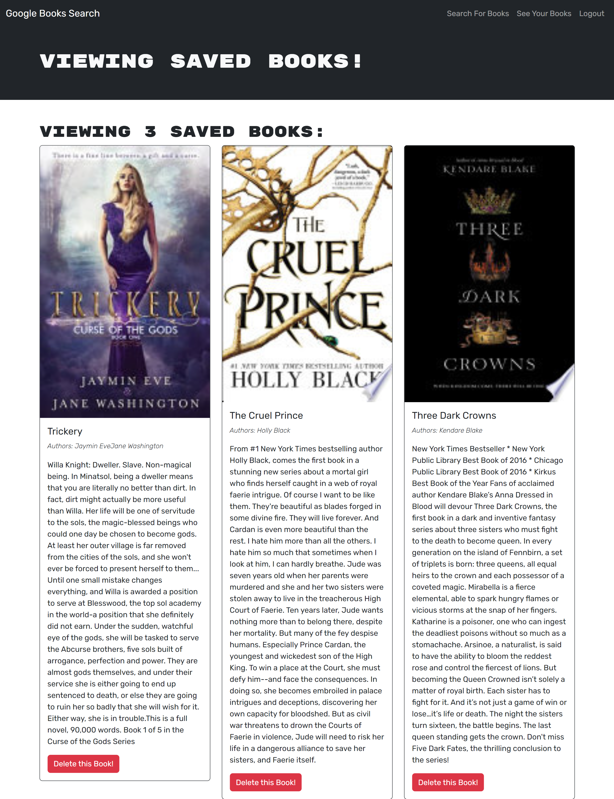

# Book Search Engine

[](https://opensource.org/licenses/MIT)
  
## Description
  
The application is a powerful search engine, leveraging the extensive Google Books API to allow users to find their next great read with ease. It was developed using the MERN stack, a powerful combination of MongoDB, Express.js, React, and Node.js, ensuring an efficient and responsive application.

The task involved transitioning a Google Books search engine application from a RESTful API to a GraphQL API, using Apollo Server. This MERN stack (MongoDB, Express.js, React, and Node.js) application was originally set up to allow users to save book searches to the back end. The refactoring replaced RESTful API endpoints with GraphQL queries and mutations, maintaining the existing functionality of saving book searches. The transition not only modernized the application but also improved performance and scalability, making the application more versatile, efficient and powerful in handling user's searches and saved books.

[Deployed Application](https://vast-tundra-70816.herokuapp.com/)
  
## Table of Contents

- [Screenshots](#screenshots)
- [Installation](#installation)
- [Technologies](#Technologies)
- [License](#license)

## Screenshots


  
## Installation
  
To install necessary dependencies, run 'npm i' command:
```
npm i
```
To build your app, run 'npm run build' command:
```
cd client && npm run build
```
To start your app, run 'npm start' command:
```
cd client && npm start
```

## Technologies
  
* [MongoDB](https://www.mongodb.com/) 
* [Google Books API](https://developers.google.com/books)
* [Express.js](https://expressjs.com/)
* [React](https://react.dev/)
* [Node.js](https://nodejs.org/en)
  
## License
    
This project is licensed under the [MIT](https://opensource.org/licenses/MIT) license.